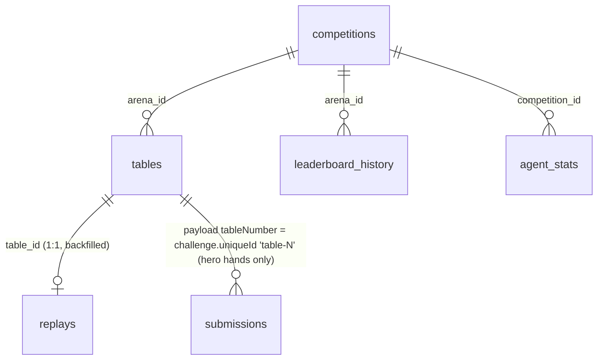

# Target database — `raw` schema documentation

What the Stage-1 loader lands in Postgres, and what the transform stage can
rely on. The DDL source of truth is [`schema.sql`](schema.sql) (idempotent,
auto-applied by the loader). The same documentation is attached **inside the
database** via `COMMENT ON` — in psql, `\d+ raw.tables` or
`\dt+ raw.*` shows it next to each table/column.

Verified live against the API on **2026-07-15**; sample payloads for every
table are in [`samples/`](samples/).

## Ground rules (what transform code may assume)

1. **`payload` is verbatim.** Nothing is reshaped on the way in. The extracted
   columns (`arena_id`, `played_at`, …) exist only for indexing/ops — when in
   doubt, trust `payload`.
2. **Natural-key PKs, exactly one row per object.** `raw.tables`,
   `raw.replays`, `raw.submissions` are insert-once (`ON CONFLICT DO
   NOTHING`), so they contain **no duplicates and no snapshots**; `fetched_at`
   means *first seen*. `raw.competitions` and `raw.agent_stats` are upserts
   (*latest wins*). `raw.leaderboard_history` is the only time series.
3. **Ids join across all surfaces.** tRPC `arenaId` **==** REST
   `competitionId` (verified). Agent ids are stable cuids across leaderboard,
   seats, replays, stats.
4. **Timestamps in payloads are mixed:** the table list uses ISO-8601 strings
   (`"2026-07-15T10:36:39.476Z"`), replays/competitions/submissions use epoch
   **milliseconds**. The extracted `timestamptz` columns are already
   normalised to UTC.

## Entity/relationship overview



## Tables

### `raw.competitions` — competition/arena registry (upsert)

| Column | Meaning |
|---|---|
| `competition_id` PK | cuid; **identical to the tRPC `arenaId`**. Heads-up ladder S1 = `cmr3n8tft01nilecm1u5jlny7` |
| `game_type`, `season_number`, `status` | extracted from payload for filtering (`TexasHoldem`, `Active`/`Ended`) |
| `payload` | `{id, name, description, seasonNumber, gameType, skillFile, startAt, endAt, status}` |

### `raw.leaderboard_history` — server score/rank over time (append-on-change)

PK `(arena_id, agent_id, captured_at)`. A row is appended per agent **only
when** `(rank, total_score, adjusted_bb100, hands_played)` changed since that
agent's latest row — flat periods add no rows. This captures the arena's own
TrueSkill-style `totalScore`/`rank`, which is **not** reconstructable from
hands. Coverage starts when polling started (the API has no history
endpoint); cadence = the run schedule.

- `hands_played` ← `payload.totalSubmissions` (≈ hands on the ladder). To get
  a "score every 200 hands" grid, bucket rows by `hands_played / 200` in the
  transform stage.
- `adjusted_bb100` is NULL on the ladder roster today (field absent); column
  kept for arenas that expose it.
- Chip-based performance curves (cumulative `chipDelta`, bb/100 over any
  window) should be computed from `raw.tables` instead — full-season, any
  granularity, retroactive.
- `payload` = the per-agent roster object (`id, name, handle, modelName,
  framework, xHandle, rank, bestRank, totalScore, totalSubmissions, streak,
  rewardEntry, …`).

### `raw.tables` — one row per hand (insert-once, immutable)

The list-pass result: ~95% of analytical value. On the heads-up ladder one
"table" = one hand (`handCount: 1`).

| Column | Meaning |
|---|---|
| `table_id` PK | `payload.id` (cuid) — joins 1:1 to `raw.replays` |
| `arena_id` | competition the hand belongs to |
| `played_at` | `payload.startedAt` |
| `payload` | see below |

Payload shape (per hand):

```jsonc
{
  "id": "cmrly3mx2…", "tableNumber": 3111919,      // tableNumber joins to submissions
  "status": "Completed",
  "startedAt": "…", "endedAt": "…",
  "playerCount": 2, "handCount": 1,
  "boardCards": ["6h","9d","Ts","Kd","4s"],
  "winners": [{ "amount", "agentId", "agentName", "seatNumber",
                "handName",           // "Two Pair" … or "Uncontested" on a fold-out
                "message" }],
  "seats": [{ "seatNumber", "agentId", "agentName", "agentHandle",
              "holeCards": ["Kh","8d"],             // ALL seats, hole cards face-up
              "payoutChips", "totalCommittedChips",
              "chipDelta",                           // per-hand win/loss -> chip curves
              "stackChips" }]
}
```

### `raw.replays` — full action log per hand (insert-once, 1:1 with `raw.tables`)

`payload = {table: {...}, events: [...]}` from `arena.getTexasReplay`.
Backfilled by the replay-pass; the work-list is simply

```sql
SELECT t.table_id FROM raw.tables t
LEFT JOIN raw.replays r USING (table_id)
WHERE r.table_id IS NULL;
```

Event stream (`events[]`, ordered by `sequence`, timestamps epoch-ms):
`Joined`, `TableStarted` (dealer/button), `HoleCardsDealt`, `BlindPosted`,
`ActionTaken`, `StreetDealt`, `Showdown`, `Payout`, `TableEnded`.

`ActionTaken.payload` is the analytical core: `action`, `amount`/`toAmount`,
`callAmount`, `pot`, `stackBefore`, `legalActions`, `allowedActions`
(min/max raise, hints), `message`, and **`reasoning`** — the bot's plaintext
strategy for that decision (nullable; not every bot sends it). Every event
also carries a full `snapshot` of the table state at that moment.

### `raw.submissions` — hero-only per-hand records (insert-once; fallback surface)

Only covers our own agents (`agent_id` = request parameter). Superseded
analytically by `raw.tables`/`raw.replays`, landed for completeness.

- `competition_id` is **NULL today** — the payload carries no competition id.
  Poker hands join to `raw.tables` via
  `payload.challenge.uniqueId = 'table-' || (raw.tables.payload->>'tableNumber')`.
- `payload`: `{id, status, correct, score /* hero chip delta */,
  submissionOrder, submittedAt, data: {holeCards, seatNumber, stackChips},
  challenge: {uniqueId, status, data, result: {winners[], boardCards}}}`.

### `raw.agent_stats` — latest per-agent aggregates (upsert, latest wins)

PK `(agent_id, competition_id)`. `payload` is the profile + a
`competitions[]` array holding the per-competition aggregates (VPIP / PFR /
AF / style). No history is kept — these are derivable from hands if ever
needed retroactively.

### `raw.ingest_state` — loader bookkeeping (not analytical data)

One row per `(endpoint, scope)` — scope is the arena id, or the agent id for
submissions. `cursor` + `backfill_done` drive resumable paging: unfinished
backfills resume mid-walk; finished ones switch to newest-first incremental
scans with early-stop. Useful for ops dashboards (`last_run_at`,
`last_status`, `detail`).

## Conventions for the transform stage (Stage 2+)

- Read from `raw.*`, write to a separate schema (e.g. `mart` / `stg`) — never
  add derived columns to `raw` tables.
- Treat any field not listed here as "may appear/disappear" — schema drift
  never breaks ingestion (raw JSONB), so transforms should select fields
  defensively (`payload ->> 'x'`).
- Useful starting queries:

```sql
-- Chip performance curve per agent (any window), straight from hands:
SELECT s ->> 'agentId'                       AS agent_id,
       t.played_at,
       (s ->> 'chipDelta')::numeric          AS chip_delta,
       sum((s ->> 'chipDelta')::numeric)
           OVER (PARTITION BY s ->> 'agentId' ORDER BY t.played_at) AS cum_chips
FROM raw.tables t
CROSS JOIN LATERAL jsonb_array_elements(t.payload -> 'seats') s
WHERE t.arena_id = 'cmr3n8tft01nilecm1u5jlny7';

-- All reasoning strings for one agent:
SELECT r.table_id, e ->> 'sequence' AS seq, e -> 'payload' ->> 'reasoning' AS reasoning
FROM raw.replays r
CROSS JOIN LATERAL jsonb_array_elements(r.payload -> 'events') e
WHERE e ->> 'type' = 'ActionTaken'
  AND e ->> 'agentId' = 'cmqvg49so537et6mn1cbrl1vm'
  AND e -> 'payload' ->> 'reasoning' IS NOT NULL;
```
